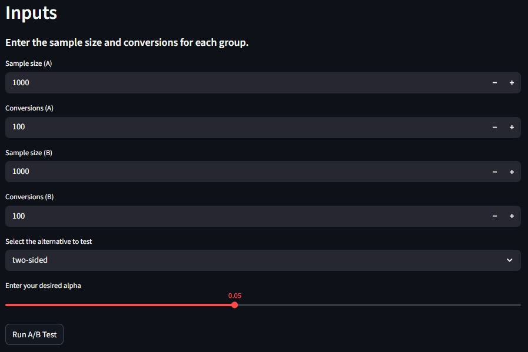
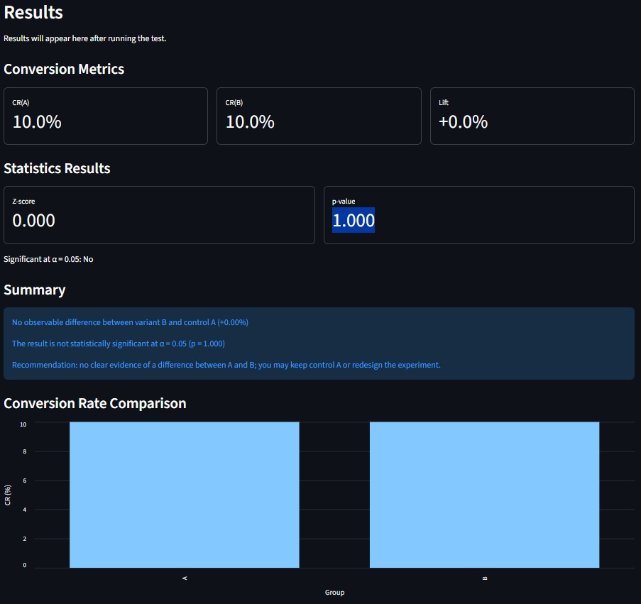

# 🧪 A/B Test Playground

Interactive Streamlit App for Simulating and Analyzing A/B Experiments

A clean, modular, and end-to-end A/B testing playground built with **Python**, **Streamlit**, and a fully custom **statistical engine**.  
Designed as a portfolio-quality tool for demonstrating experiment analysis, statistical reasoning, and product-focused insight generation.

---

## 🚀 Features

### 🔢 Core Statistical Engine

- Conversion rate calculation
- Absolute and relative lift
- Two-sample **z-test for proportions**
- P-value computation (two-sided, one-sided “larger”, one-sided “smaller”)
- Input validation with custom exception handling
- Structured results delivered via an `ABTestResult` dataclass

### 🖥️ Streamlit Interface

- Clean input forms for A/B sample sizes and conversions
- Selection of hypothesis test type and significance level (α)
- Conversion metrics displayed in metric cards
- Statistical results (z-score, p-value, significance)
- Automated business-friendly summary explaining:
  - whether B performs better/worse
  - if the difference is statistically significant
  - whether to ship, continue testing, or keep control
- Side-by-side CR(A) vs CR(B) comparison chart
- Educational expanders explaining:
  - What is an A/B Test
  - Control vs Variant
  - Conversion rate
  - P-value

### 🧱 Modular Code Structure

```
abtesting/
    stats.py       → Statistical computations & validation
    copydeck.py    → Educational explanations + summary builder
app.py             → Streamlit UI
requirements.txt
```

---

## 📸 Screenshots

_Add screenshots or GIFs here once you upload them._

Suggested screenshots:

- 
- 

---

## 📊 How the App Works

1. **User enters input data**:

   - Sample size A / B
   - Conversions A / B
   - Significance level (α)
   - Hypothesis alternative

2. **Engine validates inputs**:

   - No negative values
   - Conversions ≤ sample size
   - Sample size > 0

3. **Statistical module computes**:

   - Conversion rates
   - Lift
   - Pooled proportion
   - Standard error
   - Z-score
   - P-value

4. **Result is evaluated**:

   - Is it significant at α?
   - Is B better or worse?
   - What does that mean in practice?

5. **Streamlit displays**:
   - Metrics summary
   - Statistical results
   - Human-readable business recommendation
   - A visualization of CR differences

---

## 🛠️ Installation

1. Clone the repository:

```bash
git clone <https://github.com/nachospreafico/ab-test-playground>
cd <ab-test-playground>
```

2. Install dependencies:

```bash
pip install -r requirements.txt
```

3. Run the app:

```bash
streamlit run app.py
```

---

## 📦 Requirements

Core libraries:

- `streamlit`
- `pandas`
- `scipy`
- `numpy`

(Full list in `requirements.txt`.)

---

## 🧭 Roadmap (Potential Future Improvements)

- Add **Bayesian A/B testing** (Beta distributions)
- Add **statistical power & sample size calculator**
- Add **credible interval charts**
- Add **bootstrap confidence intervals**
- Add ability to simulate random experiments
- Add CSV upload for real experiment data
- Add dark/light theme toggle
- Deploy on Streamlit Cloud or HuggingFace Spaces

---

## 👨‍💻 Tech Stack

- **Python 3.10+**
- **Streamlit** for UI
- **SciPy** for statistical distribution functions
- **Pandas** for simple data handling

---

## 📬 Contact

**Ignacio Spreafico**  
Data & Business Analyst | Driving Decisions with Python, SQL & Power BI | Statistics & Machine Learning

📧 Email: **nachospreafico06@gmail.com**  
🔗 LinkedIn: **https://www.linkedin.com/in/ignacio-spreafico**  
🐙 GitHub: **https://github.com/nachospreafico**

---

## ⭐ Support / Feedback

If you like this project, consider leaving a ⭐ on GitHub!  
This project is part of my data science portfolio and demonstrates statistical reasoning, product analytics thinking, and clean code practices.
